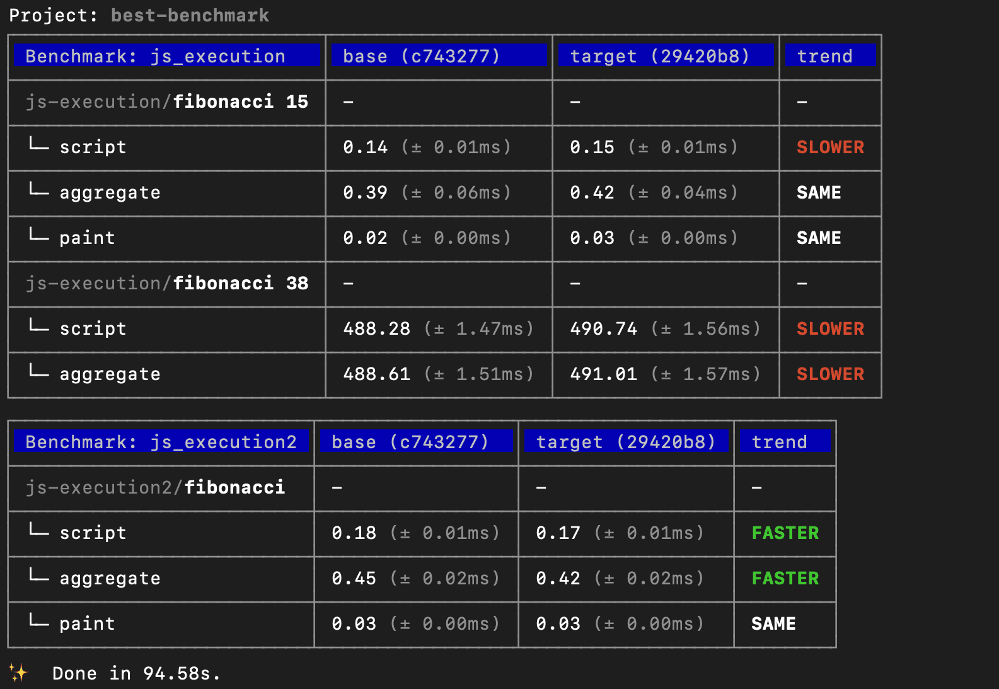
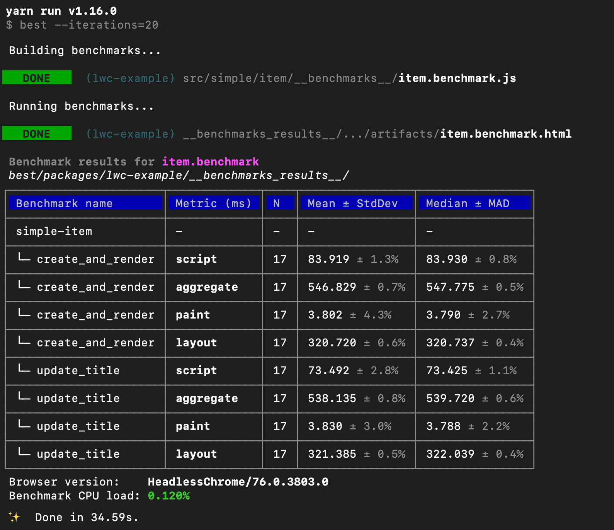
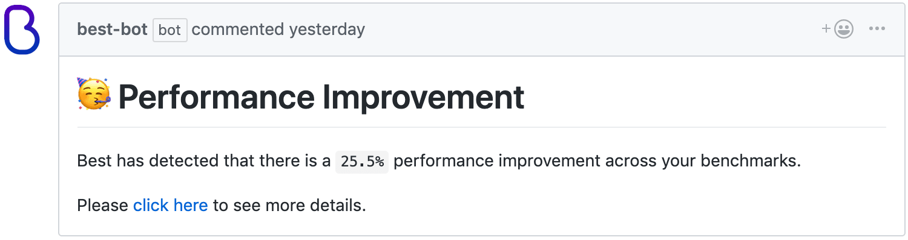
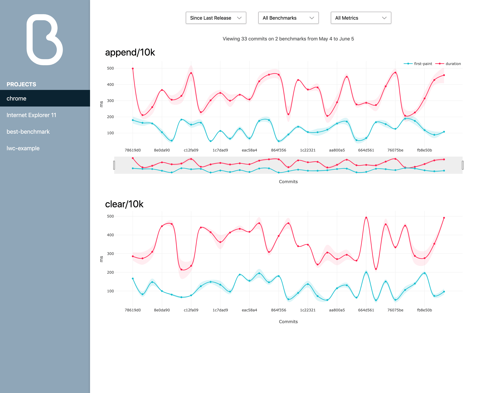

# Best

**Delightful Benchmarking & Performance Testing**

[Learn the fundamentals of Best](introduction/) and begin accurately
measuring your code's performance.

* Easy to Write

  Benchmarks are easy to write with a simple set of familiar primitives
  so you don't have to learn a whole new framework.

* Anywhere and Anytime

  You can run, compare, and diff any change locally and on dedicated
  hardware. This lets you compare any version in any browser you desire.

* Simple Automation

  Best allows you to set up one set of shared hardware so individual
  teams don't have to maintain their own infrastructure.

## Getting Started with Best

Best allows you to write benchmarks the same way you write unit tests.
This allows you to integrate Best into your CI workflow to create
a consistent picture of your code's performance over time. Ready to
jump in? Check out the [Guide](introduction/) to read about how to get
started!

```js
import fib from '../fib';

describe('js-execution', () => {
 benchmark('fibonacci 15', () => {
  run(() => {
   return fib(15);
  })
 })

 benchmark('fibonacci 38', () => {
  run(() => {
   return fib(38);
  })
 })
})
```

## Why Use Best?

### Reproducible Results

Best is designed to run on dedicated hardware so your benchmarks run
in the same environment every time. We recommend this so your results
are not affected by inconsistent environments.

The Best Hub and Agent model works great for implementing this.
Learn more in [Setting Up a Best Hub](running-remotely/).



### Expressive Metrics

Best comes with the ability to measure all the metrics you might want
to know. Learn more in [Expressive Metrics](introduction/#expressive-metrics).

* `aggregate` - The total time your benchmark took to run.
* `script` - The time it took to evaluate your benchmark code.
* `paint` - If your benchmark involves the DOM, Best measures how much
  time the browser spends on painting.
* `layout` - If your benchmark involves the DOM, Best measures how much
  time the browser spends on layouts.



### GitHub Integration

If your team uses GitHub, you can create a GitHub app that integrates
Best into your pull request workflow.

Best comes with a built-in GitHub bot that creates
[checks](https://help.github.com/en/articles/about-status-checks) and
comments when a pull request causes a significant performance change.
Learn more in [Integrating Best with GitHub](github-integration/).



### The Best Front End

Best comes with a front-end dashboard to monitor your benchmarks
by commit over time. This allows you to pinpoint which commits cause
performance improvements and regressions.

The front end allows you to view all your projects and benchmarks in
one place. Learn more in [Enabling The Best Front End](frontend/)


