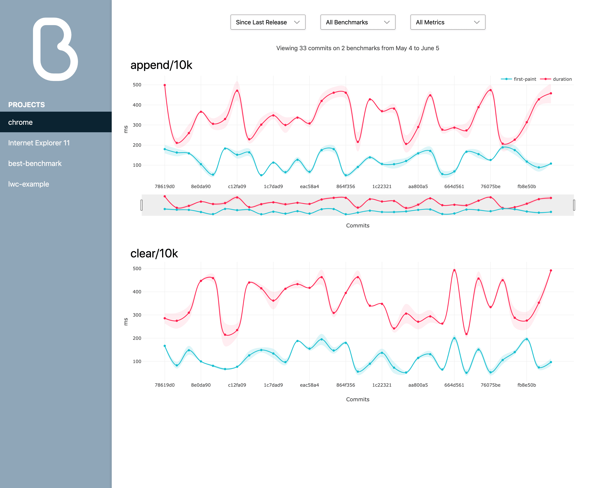

# Best Front End

The Best Front End provides a powerful tool to view the performance
of your code. Use the front end to view all your projects and benchmarks
in one place.



Check out the live demo to see a front end showing Best's own
examples.

?> To use the front end, [configure](#configuring-apidatabase) your
   `best.config.js` to use a hosted API database to store the result
   summaries.

## Manual Installation

You can create your own server to host the front end. Follow
[this template](https://github.com/salesforce/best-heroku-deploy/tree/frontend)
and the following steps.

1. Add the `@best/frontend` package.

    ```sh
    yarn add @best/frontend
    ```

1. Create a file like `serve.js` that creates the HTTP server.
   This example uses [Express](https://github.com/expressjs/express)
   as the web server.

    ```js
    import express from 'express';
    import { Frontend } from '@best/frontend';
    import config from './best-frontend.config';

    const PORT = process.env.PORT || 3000;

    const app = express();

    app.use(Frontend(config));

    app.listen(PORT);
    ```

1. This code is the `best-frontend.confg` configuration file.

    ```js
    export default {
        apiDatabase: {
            adapter: 'sql/postgres',
            uri: 'postgresql://localhost', // Provide the connection URI to your hosted postgres database
        },
        githubConfig: {
            // (optional) Allows the frontend to fetch commit info directly from GitHub
            owner: 'salesforce',
            repo: 'best',
        },
    };
    ```

1. Start the server and point your browser as its URL.

1. To enable the GitHub integration in the frontend follow the
   [Github integration guide](../github-integration/).

## Configuring `apiDatabase`

To store your results in a hosted database (which is required for
the front end to work) you must set the `apiDatabase` field in your
`best.config.js` file or pass command line arguments

### Configuration File

To specify the hosted API database, add the following to your
`best.config.js`.

```js
{
    apiDatabase: {
        adapter: 'sql/postgres',
        uri: 'postgresql://localhost'
    },
}
```

### CLI Arguments

If the configuration file approach is not suitable for your environment,
specify the following command-line arguments.

```sh
best --dbAdapter=sql/postgres --dbURI=postgresql://localhost
```

This command overrides the configuration in `best.config.js`.
